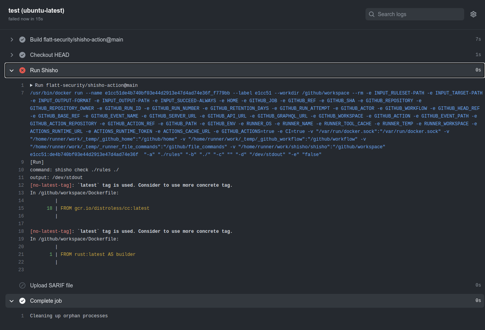

# Shisho Action

[GitHub Action](https://github.com/features/actions) for [Shisho](https://github.com/flatt-security/shisho)

[![GitHub Release][release-img]][release]
[![GitHub Marketplace][marketplace-img]][marketplace]
[![License][license-img]][license]
[![Documentation][documentation-img]][documentation]



## Usage

### Example Workflow

```yaml
name: "Run tests with Shisho"

on:
  push:

jobs:
  test:
    runs-on: ubuntu-latest
    steps:
      - name: Checkout HEAD
        uses: actions/checkout@v1
      - name: Run Shisho
        uses: flatt-security/shisho-action@main
        with:
          ruleset-path: "./rules"
```

### Integration with GitHub Code Scanning

You can integrate Shisho with GitHub code scanning as follows:

```yaml
name: "Run tests with Shisho"

on:
  push:

jobs:
  test:
    runs-on: ubuntu-latest
    steps:
      - name: Checkout HEAD
        uses: actions/checkout@v1
      - name: Run Shisho
        uses: flatt-security/shisho-action@main
        with:
          ruleset-path: "./rules"
          target-path: "./"
          output-format: "sarif"
          output-path: "shisho.sarif"
          succeed-always: true
      - name: Upload SARIF file
        uses: github/codeql-action/upload-sarif@v1
        with:
          sarif_file: ./shisho.sarif
```

## Configurations

This action has the following inputs that can be used as `step.with` keys:

| Name                      | Type   | Default              | Description                                                                                          |
| ------------------------- | ------ | -------------------- | ---------------------------------------------------------------------------------------------------- |
| `ruleset-path` (required) | String |                      | Path of Shisho rule sets                                                                             |
| `target-path`             | String | `/github/workspace/` | Path of files to search over                                                                         |
| `output-format`           | String |                      | Output format (one of `json`, `console`, and `sarif`)                                                |
| `output-path`             | String | `/dev/stdout`        | Path of output files (When you specify `/dev/stdout`, you can output the results to standard output) |
| `succeed-always`          | bool   | `false`              | Whether to force exit code to be 0 regardless of findings.                                           |

[release]: https://github.com/flatt-security/shisho-action/releases/latest
[release-img]: https://img.shields.io/github/release/flatt-security/shisho-action.svg?logo=github
[marketplace]: https://github.com/marketplace/actions/flatt-security-shisho
[marketplace-img]: https://img.shields.io/badge/marketplace-shisho--action-blue?logo=github
[license]: https://github.com/flatt-security/shisho-action/blob/main/LICENSE
[license-img]: https://img.shields.io/github/license/flatt-security/shisho-action
[documentation]: https://docs.shisho.dev
[documentation-img]: https://img.shields.io/badge/docs-docs.shisho.dev-purple
